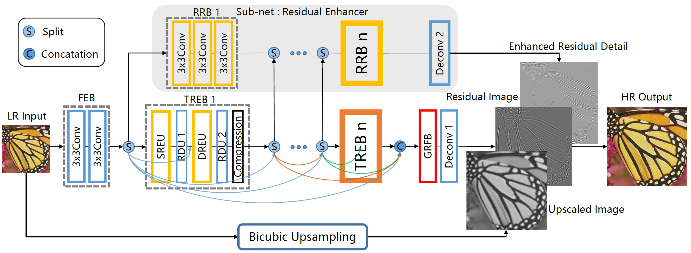
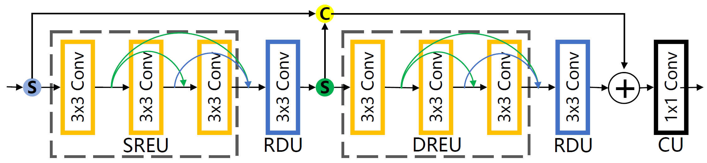
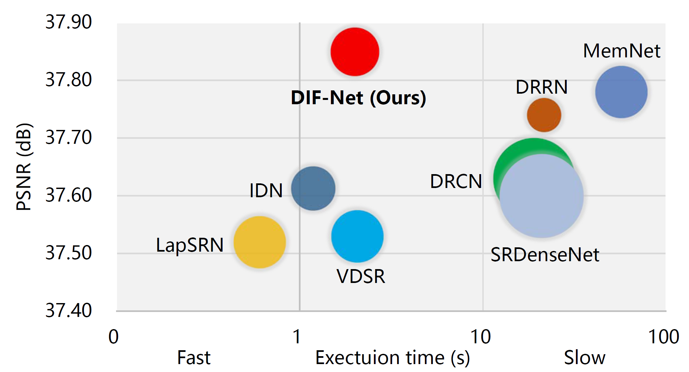
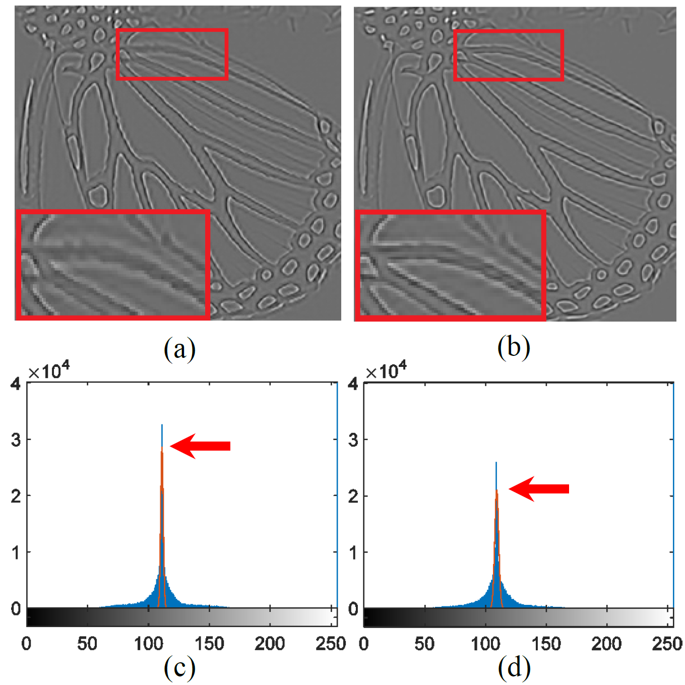
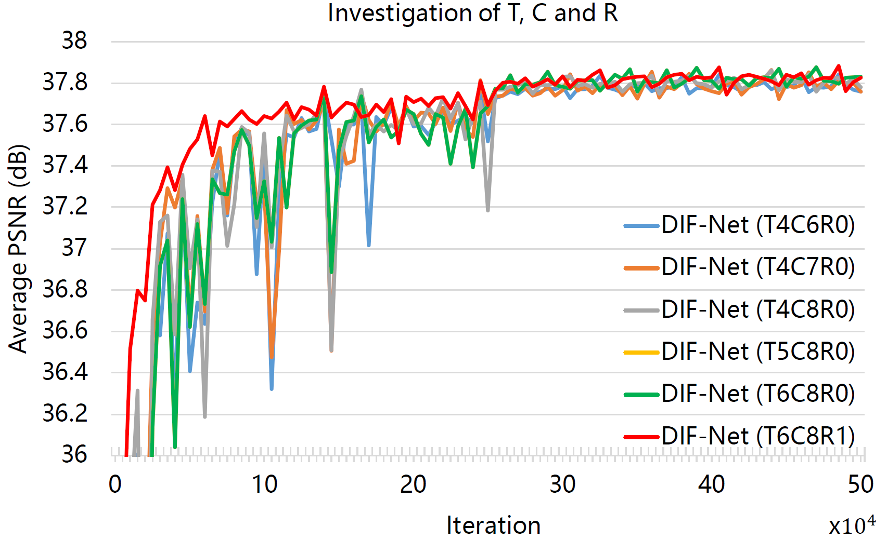
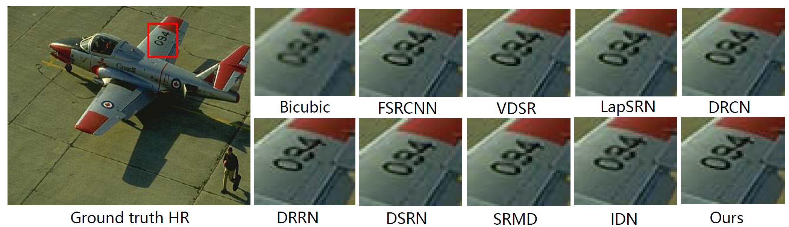

# DIF-Net-Caffe
Caffe implementation of "RESIDUAL MAGNIFIER: A DENSE INFORMATION FLOW NETWORK FOR SUPER RESOLUTION" 

      
    <em> The schematics of the proposed Dense Information Flow Network.</em>

      
    <em> Architecture of the proposed TREB. </em>

      
    <em> Trade-off between average performance vs. speed and parameters, and the size of the circle represents the number of parameters. </em>

      
    <em> The residual images comparison and corresponding data distribution histogram analysis. </em>

      
    <em> Convergence analysis of DIF-Net with different values of T, C, and R. </em>

      
    <em> Visual qualitative comparison. </em>

## Requirements and Dependencies
* MATLAB (we test with MATLAB R2015b on Ubuntu 16.04 and Windows 8.1).
* Cuda & Cudnn (we test with Cuda 8.0 and Cudnn 5).

**Note:** Please make sure the matcaffe is complied successfully.

## Testing
* step 1: Download testing dataset and put them into ./test/test_data
* step 2: Put the trained caffemodels in ./train/caffemodel into ./test/caffemodel
* step 3: Run ./test/Demo, if it can not run successfully, maybe you can try to change "caffe.set_mode_gpu()" to "caffe.set_mode_cpu();". Besides, if errors happen in one dataset, just put it aside and test other datasets.

The results are stored in "results" folder, with both reconstructed images and PSNR/SSIM.
## Training
* step 1: Download training dataset and put them into ./train/DIV2K_train_HR
* step 2: Run `data_aug.m` to augment DIV2K dataset
* step 3: Run `generate_train_IDN.m` to convert training images to hdf5 file
* step 4: Run `generate_test_IDN.m` to convert testing images to hdf5 file for valid model during the training phase
* step 5: Run `train_DERI_x2_D4C6R0.bat` to train x2_D4C6R0 model

## Citation

If you find DIF-Net useful in your research, please consider citing:

@inproceedings{DIF-Net-2019,
  title={RESIDUAL MAGNIFIER: A DENSE INFORMATION FLOW NETWORK FOR SUPER RESOLUTION},
  author={Zhan Shu, Mengcheng Cheng, Biao Yang, Zhuo Su, Xiangjian He},
  booktitle={ICME},
  year={2019}
}

## Contact
If you have any questions and requirements on the technology or the paper, please contact to Zhan Shu with email 474048176@qq.com, thank you.